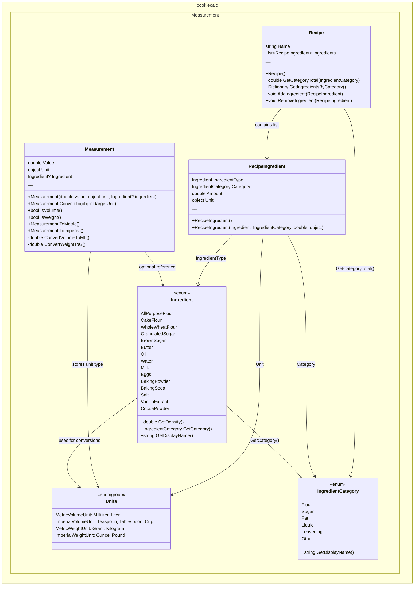

# CookieCalc Domain Model Architecture

## Class Descriptions

### Units
Enumerations for measurement units supporting both metric and imperial systems:
- **MetricVolumeUnit** - Milliliter, Liter
- **ImperialVolumeUnit** - Teaspoon, Tablespoon, Fluid Ounce, Cup, Pint, Quart, Gallon
- **MetricWeightUnit** - Gram, Kilogram
- **ImperialWeightUnit** - Ounce, Pound

### Ingredient (Enum)
21 pre-configured baking ingredients with:
- **Density mappings** - Grams per milliliter for volume↔weight conversion
- **Category mapping** - Automatically assigned to one of 6 categories
- **Display name** - Human-readable ingredient names
- **Extensions** - `GetDensity()`, `GetCategory()`, `GetDisplayName()`

### IngredientCategory (Enum)
Organizes ingredients into 6 functional categories:
- **Flour** - Baking bases
- **Sugar** - Sweeteners
- **Fat** - Binding/moisture
- **Liquid** - Hydration
- **Leavening** - Rise agents
- **Other** - Flavor/texture additives

### Measurement (Class)
Handles unit conversions and ingredient-aware calculations:
- Stores value with unit type
- Optional ingredient reference for density-based conversions
- Methods: `ConvertTo()`, `IsVolume()`, `IsWeight()`, `ToMetric()`, `ToImperial()`
- Supports volume→weight conversion using ingredient density

### Recipe (Class)
Represents a complete cookie recipe:
- `Name` - Recipe identifier
- `Ingredients` - List of `RecipeIngredient` items
- `GetCategoryTotal()` - Sum weight (in grams) of all ingredients in a category
- `GetIngredientsByCategory()` - Group ingredients by category
- `AddIngredient()` / `RemoveIngredient()` - Manage ingredient list

### RecipeIngredient (Class)
Single ingredient entry linking all necessary information:
- `IngredientType` - Which ingredient
- `Category` - Which category (from ingredient.GetCategory())
- `Amount` - Numeric quantity
- `Unit` - Unit of measurement
- Used by `Recipe` to maintain the ingredient list
